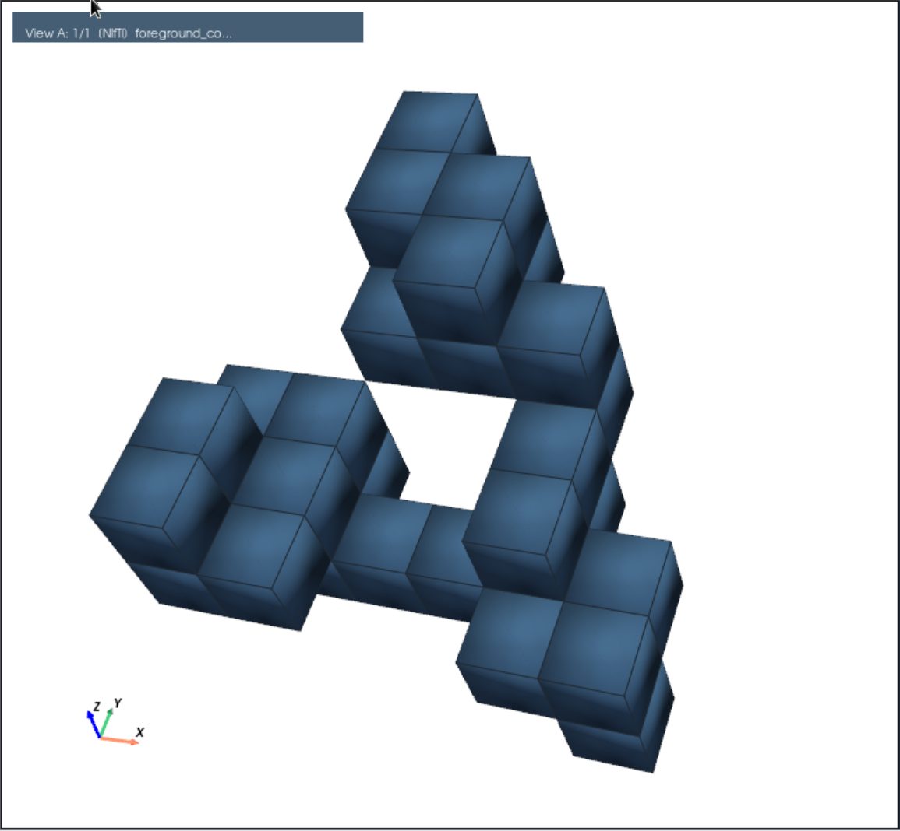
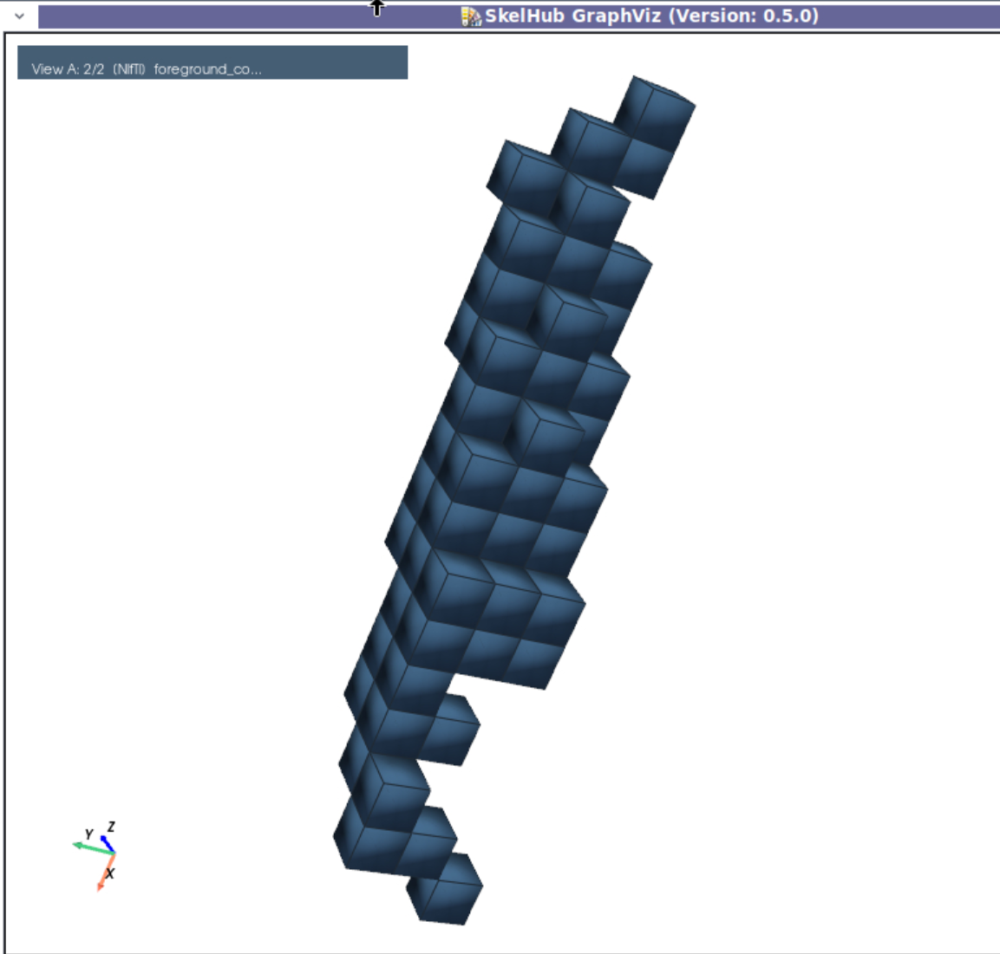
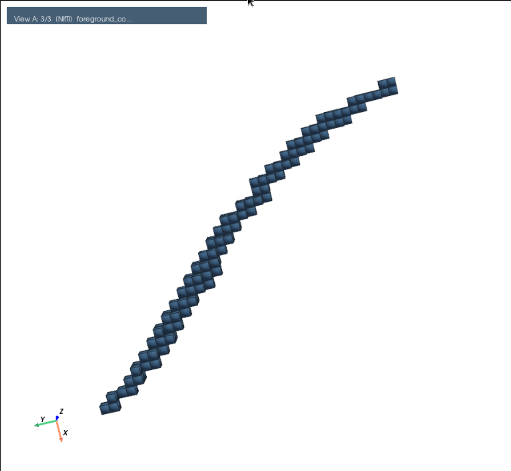
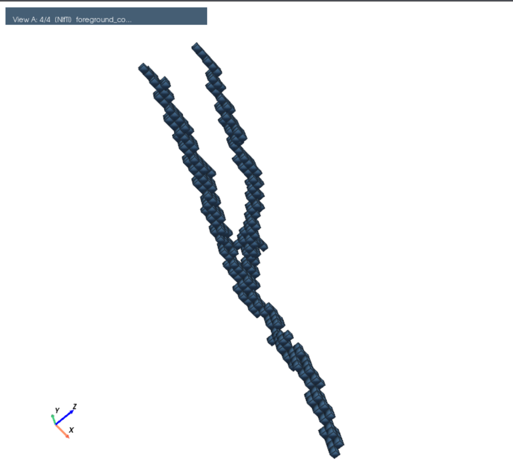
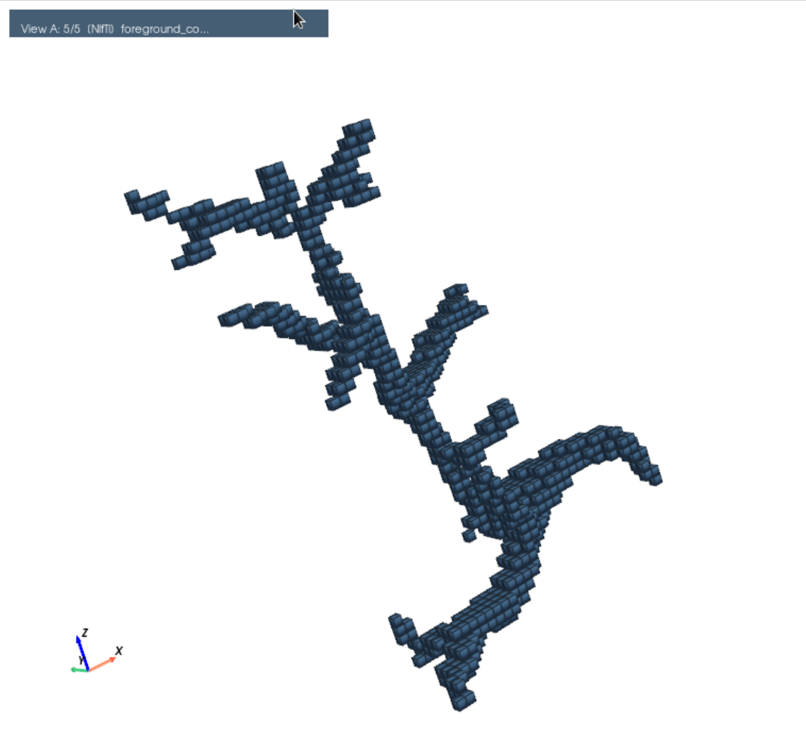
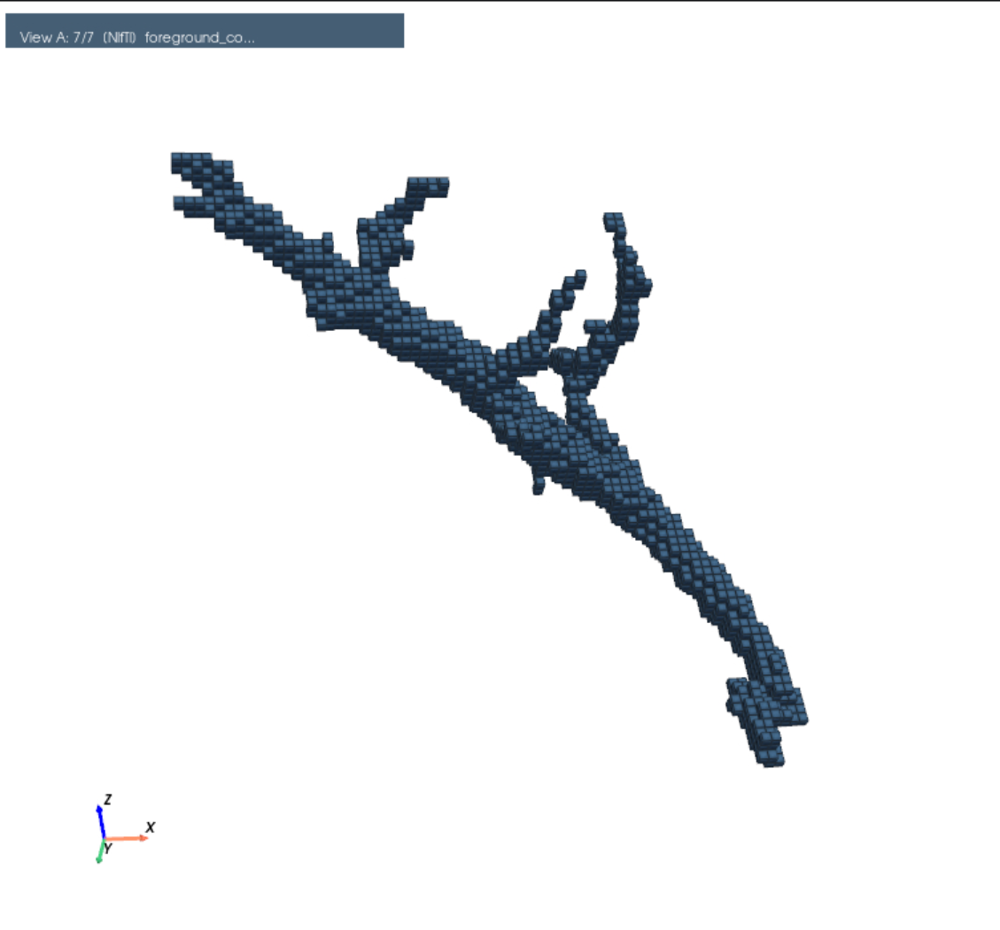
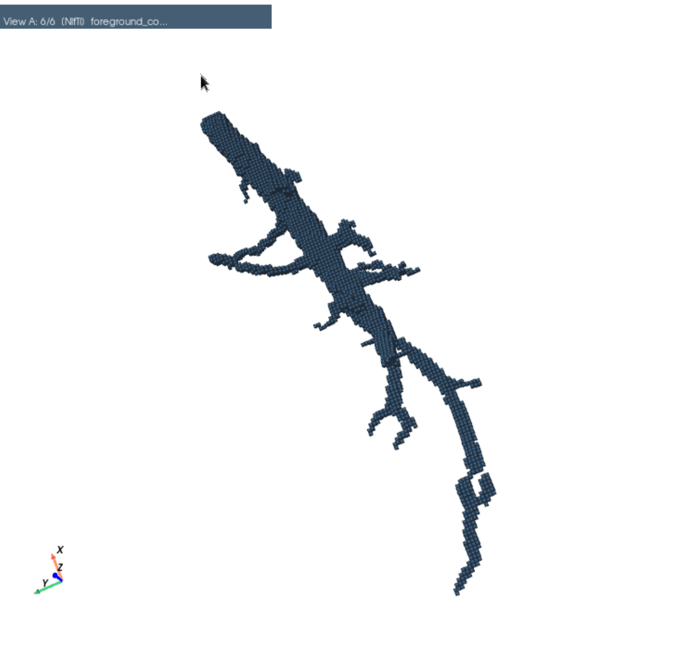
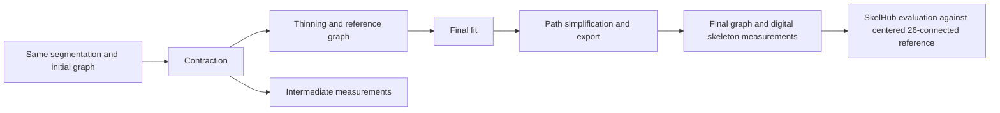

# Test plan — Updated: 04 October 2026

Purpose: screen the new features today, identify parameter exposure gaps, and produce reproducible pilot evidence for the planned submission in about one month. These are proposed experiments and screening values, not validated optimal settings or publication results.

## 1. Scope and first decisions

| Branch           | Inspected commit                             | New behavior relative to the shared baseline                                                                                                                                                                                |
| ---------------- | -------------------------------------------- | --------------------------------------------------------------------------------------------------------------------------------------------------------------------------------------------------------------------------- |
| Shared baseline  | `d143dbd77b6daf623ed2d952186d3b496ac0f682` | Current`master`; use this exact revision for both comparisons.                                                                                                                                                            |
| `dev-workflow` | `f52eabf`                                  | Replaces the final geometric fit with a constrained, frozen Laplacian fit in physical space; fixes non-degree-two nodes; retains edge paths; checks deformation/intersections; exports GraphML against original foreground. |
| `dev-obj`      | `d17fa26`                                  | Adds signed-distance flux attraction and resistance to longitudinal movement; coupled objective solver with backtracking; requires segmentation; converts new physical quantities to mm in the default workflow.            |

Both branches contain one new commit beyond the same baseline. Test each against that baseline independently. A direct comparison between their heads cannot attribute an effect to one feature, and neither head contains the other branch's feature.

**Exposure recommendation:** expose final-fit strength through the `dev-workflow` public API/CLI before a production sweep. `dev-obj` already exposes its two new weights. Expose iteration budgets and return/save diagnostics through a research harness to distinguish poor parameter choices from incomplete optimization. Do not change defaults as part of this plan.

The user will use `tests/test_data/aug_lap_nif` for qualitative comparison. Compute budget is unspecified; this plan assumes one workstation and an approximately eight-hour screening day. Use small cached cases first and stop optional sweeps when the budget is exhausted.

## 2. Shared data, controls, and measurements

### Existing qualitative fixtures

Inventory inspected today: **1,251 NIfTI files**, all declaring **mm**, all with approximately **(0.05, 0.05, 0.05) mm** spacing. Foreground counts span **30–577,510**; median **144**, approximately 75th percentile **408** and 90th percentile **1,148**. These fixtures do not test anisotropy by themselves.

Start with these seven reproducible size-stratified candidates. Filenames below are under `tests/test_data/aug_lap_nif/`; labels identify crops, not verified anatomical categories.

| Label / filename                                                           | Foreground voxels | Role                      | Screenshots                                              |
| -------------------------------------------------------------------------- | ----------------: | ------------------------- | -------------------------------------------------------- |
| `foreground_component_label_0161_bbox_x17-24_y319-327_z134-142.nii.gz`   |                30 | Tiny-component smoke test |  |
| `foreground_component_label_0962_bbox_x151-159_y306-324_z76-81.nii.gz`   |                60 | Small crop                |  |
| `foreground_component_label_0830_bbox_x129-151_y115-143_z150-191.nii.gz` |               144 | Median-size crop          |  |
| `foreground_component_label_0821_bbox_x126-147_y323-371_z87-123.nii.gz`  |               408 | Medium crop               |  |
| `foreground_component_label_2430_bbox_x427-480_y264-306_z95-126.nii.gz`  |             1,148 | Larger crop               |  |
| `foreground_component_label_0001_bbox_x0-57_y0-65_z151-188.nii.gz`       |             2,043 | Larger crop               |  |
| `foreground_component_label_1220_bbox_x196-244_y215-380_z31-93.nii.gz`   |             7,472 | Optional scaling case     |  |

Before comparing outputs, inspect the inputs and choose four of the first six as today's qualitative panel, seeking a curve, a junction/short terminal branch, and a narrow or boundary-contact case. Add or replace a crop if these morphologies are absent; record the selection before seeing method results. Keep the 7,472-voxel case optional. Defer the 577,510-voxel label `0008` until memory/runtime on smaller cases is understood. Flag crop-truncated ends separately from genuine anatomical terminals.

Use original segmentations as the containment reference, not as ground-truth centerlines. Do not infer accuracy from visual smoothness alone. Preserve source geometry in any overlays; use identical cameras, scale, and opaque labels hidden during review. Save one focused PNG per selected comparison, with numbered callouts and a short legend; no SVG. Rate centering, branch shortening, junction placement, false connections, and smoothness separately as worse/same/better, with failure notes.

### Quantitative fixtures

Use two existing quantitative datasets: the seven simple fixture families below and the synthetic branch structures. Both contain conceptual synthetic geometries, not anatomically exact models. Reuse the saved data without regenerating it. The local scripts `tests/benchmark_contraction_objective.py` and `tests/benchmark_frozen_refinement.py` remain stage-level harness references; adapt their input loading to the external datasets in an ignored research harness.

**Mandatory reference policy:** every quantitative comparison on either dataset must use the **foreground-centered 26-connected centreline**, named `*_26_con_centered.nii.gz`. This applies to baseline runs, all parameter settings and ablations, intermediate/final reference-error measurements, robustness variants, and any F11/F12 unbridged controls. Do not evaluate against `_6_con.nii.gz`, uncentered `_26_con.nii.gz`, or legacy unsuffixed references, even when their voxel occupancy happens to match the centered version. If a required centered reference or its provenance is missing or fails validation, mark the evaluation as blocked; never fall back to another reference version.

The authoritative centered-reference index is `/scratch/project/simvascmri/data/Synthetics/foreground_centering.json`: match each case's `centered_26_con` path, verify its `sha256`, and record the reference and report hashes with each evaluation. For continuous-path and branch measurements, use that case's ordered `branches[].voxel_path_xyz`, transformed through the centered NIfTI affine into physical coordinates. Their voxel union must reproduce the centered NIfTI. Source geometry/graph records provide branch identity, incidence, radius information, and construction provenance only; they are not alternative geometric scoring targets. The centered references are constrained digital paths, not a claim of exact medial axes; EDT agreement measures agreement with an EDT-optimized reference and is not independent proof of centering accuracy.

#### Simple fixtures

Root: `/scratch/project/simvascmri/data/Synthetics/simple_fixtures`. Foregrounds are in `nifti/`, centreline ground truths in `nifti_gt/`, and connectivity NPZ fixtures in `npz/`. Pair foreground `nifti/<case_id>.nii.gz` with centered reference `nifti_gt/<case_id>_26_con_centered.nii.gz`; the complete basenames are intentionally different. The seven families comprise **nine NIfTI pairs**: two straight-tube radii and two grids for the anisotropic comparison.

| Case                    | Construction / controlled variation                                                                          | Main question                         |
| ----------------------- | ------------------------------------------------------------------------------------------------------------ | ------------------------------------- |
| Straight tube           | Known axis; radii 2 and 4 voxels; terminal locations defined by the generating path                          | Centering and shortening              |
| Curved tube             | Circular arc or existing sinusoidal polyline; radius 2 voxels; curvature radius at least 4 times tube radius | Smoothing versus cutting corners      |
| Tapered tube            | Known straight axis; radius 4 down to 2 voxels                                                               | Distal drift and radius dependence    |
| Y junction + short stub | Known junction and terminal positions; stub length 4 voxels                                                  | Junction and terminal preservation    |
| Ring                    | Known centerline loop and one foreground tunnel                                                              | Cycle preservation and loop shrinkage |
| Two nearby tubes        | One complete background-voxel gap between surfaces                                                           | False joins and segment crossings     |
| Anisotropic curved tube | Voxelize the same physical curve at`(0.05,0.05,0.05)` and `(0.05,0.05,0.15)` mm                          | Physical-space handling               |

The case IDs are `straight_tube_r2`, `straight_tube_r4`, `curved_tube`, `tapered_tube`, `y_junction_short_stub`, `ring`, `two_nearby_tubes`, `anisotropic_curved_tube_iso`, and `anisotropic_curved_tube_aniso`. Append `.nii.gz` for foregrounds and `_26_con_centered.nii.gz` for evaluation references. Use `nifti/quantitative_fixtures_0929.json` for construction, radius profiles, and branch identity/connectivity. `nifti_gt/centerline_ground_truth.json` describes earlier digital-reference versions; use the shared `foreground_centering.json` for the centered files and scoring paths. Its branch order follows the source fixture's branch order. The five files currently in `npz/` are separately named graph fixtures; do not assume a one-to-one basename match with the nine NIfTI pairs.

For additional simple-fixture variants, use small volumes, normally no larger than 48³, and a background halo. Choose physical dimensions that fit both grids. Save the actual sampled analytic/polyline centerline, true terminals/junctions, radius profile, affine, units, and mask as construction provenance. Generate and validate a paired `_26_con_centered.nii.gz` plus centered branch-path/checksum records before any quantitative evaluation; changing a filename alone does not establish a centered reference. Do not simulate a resolution change by only editing the header: regenerate the mask from the same physical geometry. For a unit-encoding test, change the affine/header numerical units consistently for foreground, prediction, and centered reference while preserving physical geometry.

For the first screen, use one deterministic instance per case. On finalists, repeat a straight, curved, and Y case at subvoxel offsets `(0,0,0)`, `(0.25,0.25,0.25)`, and `(0.5,0.5,0.5)` voxels. These are robustness variants, not independent biological samples. Axis permutations and rotated cases can follow later to probe directional bias from flux quadrature and sequential smoothing.

#### Synthetic branch structures

Root: `/scratch/project/simvascmri/data/Synthetics/vsystem_laplacian_50um_v1`. Each of the **12 primary case directories** (`F01_*` through `F12_*`, for example `F01_straight_oblique_tube`) contains `vessel_mask.nii.gz` as foreground and `reference_skeleton_26_con_centered.nii.gz` as the required evaluation ground truth. Enumerate immediate case directories only; the nested `unbridged/` data in F11/F12 are paired secondary controls, not additional primary cases. If evaluated, pair each control's own `vessel_mask.nii.gz` with its own `reference_skeleton_26_con_centered.nii.gz` inside `unbridged/`.

Cases cover oblique straight and tortuous vessels, straight and tortuous Y junctions, asymmetric/moderate/dense trees, thin short daughters, nearby branches, and single/multiple cycles. The dataset declares isotropic 50 µm spacing (0.05 mm). Read `dataset_index.csv`, `metadata.json` and `validation_report.json` for original case provenance and QA, and the shared `foreground_centering.json` for centered-reference validation. Use each case's `reference_graph.json` and `reference_network.npz` for branch correspondence and construction metadata; obtain scoring geometry and physical path lengths from the centered report's branch paths, whose order follows that case's `reference_graph.json` branches. Do not substitute the uncentered generating paths for the centered target.

After simple-fixture screening, evaluate every primary branch case with the exact baseline and each branch's default and shortlisted setting (at most **36 runs per development branch**, sharing identical baseline runs). Keep dataset summaries separate and report all cases, including failures. This is an additional quantitative validation stage; schedule remaining cases beyond the eight-hour pilot if necessary and record them as pending. Any parameter tuning on this dataset must be disclosed; it cannot then be described as held-out validation.

### Fixed controls

- Primary mode: workflow with `use_edt=True`, `use_anisotropic=True`, `enforce_containment=True`, `w_L=0.5`, `w_H_base=0.5`, `w_H_medial=20`, `beta_edt=1`, `tol=0.05`, `local_pca_hops=1`, `decimate_every=200`, `min_edge_length=0.01`, `merge_tolerance=0.25`, `dev_contra_graph=True`, connectivity 26, solver CG, one worker.
- Keep `--dev_contra_graph` on to generate and visually compare the intermediate (before thinning) and final graph.
- Keep existing anisotropy coefficients `(alpha_norm, alpha_tang)=(1.5,0.1)` and EDT stabilizer `delta=0.5` fixed. They are existing low-level parameters, not new features requiring a broad sweep today.
- For contraction screens, a low-level harness can set `max_iter=2000`; re-use its low-level default here. The public CLI/workflow currently has no `max_iter` option; its low-level default is 2,000.
- Keep `--downsample` off: it is rejected by strict refinement. The existing seed does not create meaningful repeated trials when downsampling is off. Repeat identical runs only to assess determinism/timing.
- For every quantitative dataset run, invoke `skelhub evaluate` on the predicted digital skeleton and its paired **`*_26_con_centered.nii.gz`** reference with **`--buffer-radius 1 2 --buffer-radius-unit voxels`**, always in that order, and supply the original foreground with `--foreground`. **Approved anisotropic-only exception:** use `--buffer-radius 50 100 --buffer-radius-unit um`, because SkelHub rejects voxel-radius evaluation on anisotropic grids. These fixed physical tolerances match 1 and 2 voxels on the 50 µm isotropic control; they are not 1 and 2 anisotropic voxels. Keep both tolerance results; do not select the better radius after viewing outcomes. Save a distinct JSON report and command log for each dataset/case/branch/setting/stage.

### Measurements and acceptance rules



Follow the [SkelHub evaluation documentation](https://github.com/KMarshallX/SkelHub/blob/main/docs/evaluation.md). Its local copy at `/scratch/user/uqmxu4/Tools/SkelHub/docs/evaluation.md` (clean revision `31f08beb7e9e7d5c0543860a01f8b8e188e1ebda`) was inspected for this update because the remote document could not be fetched. Record the actual evaluator version/revision and JSON schema with each run. Evaluate binary 3D NIfTI skeletons on matching physical grids; GraphML and connectivity NPZ files are not evaluator inputs. Check shape, affine, spacing and spatial units for prediction, reference and foreground before scoring. Do not resample or relabel units merely to make an evaluation pass.

Retain SkelHub precision, recall and F1 separately at 1 and 2 voxels (1 voxel is primary), or 50 and 100 µm for the anisotropic exception (50 µm is primary), symmetric mean/P95 displacement in µm, voxel Betti counts, endpoint diagnostics, foreground EDT-sum agreement, status and warnings. Report these alongside the continuous-path measurements below: unchanged voxel skeletons can conceal changes in fitted paths. SkelHub's voxel Betti counts use foreground/background connectivity 26/6; they do not replace explicit graph branch matching or certify branch connectivity. Convert µm to mm only when explicitly combining distance tables.

1. **Geometric accuracy:** sample predicted edge polylines and the centered reference branch polylines from `foreground_centering.json` at equal physical arc-length intervals, at most `0.1 * min(spacing)`; transform reference voxel coordinates through their NIfTI affine first, and halve the sampling interval once on a finalist to check measurement stability. Use these centered polylines for all reference-distance measurements, including intermediate-stage measurements. Report both directed mean distances, their symmetric mean, and the larger directed 95th percentile distance, in mm and normalized by tube radius. Node-only averages are biased by decimation and can miss missing branches. These measurements assess agreement with a digital centered reference, not subvoxel generating-axis truth. At the dense pre-thinning stage, label them as contraction-cloud/graph distances, not final centerline accuracy.
2. **Branch fidelity:** match branches by their known synthetic identity/connectivity, but compute reference lengths, terminal positions, and junction positions from the centered branch paths. Report per-branch physical length error, matched degree-one terminal errors, junction errors, and missing/extra branches. A nearest-node distance to a reference tip is only a proxy and must not be called terminal displacement. Use the centered paths' fixed endpoint/junction anchors; source graph metadata identifies their incidence but does not replace their scoring coordinates. Exclude the immediate Y-junction overlap region from tube-axis distance summaries and measure it separately.
3. **Topology/containment:** final graph components and cycle rank `E - V + C` must match the intended cavity-free foreground topology. Also compare branch connectivity and endpoint/junction structure; cycle rank alone is insufficient. Require zero nonincident intersections and zero foreground escapes for the final continuous paths and digital skeleton. Check full segments, not only nodes. Node projection during contraction does not certify edge-interior containment. Report pre-refinement crossings separately; the initial voxel graph is not itself a centerline-topology certificate.
4. **Fit quality:** report physical bending/turning measures, displacement, and length change alongside centerline error. Compare bending energies on the same frozen graph; changing graph sampling changes the energy. Decreasing the optimization objective is not proof of anatomical improvement.
5. **Numerics and cost:** record solve status, residual, accepted updates, backtracks/rejections, outer iterations, stage runtime and peak RSS. Compare energies within a frozen solve, not across outer steps that rebuild the objective. `constraint-limited`, `iteration-limited`/`iteration_limited`, `stalled`, and `linear_failure` must remain separate from `converged`.

Hard gates are finite outputs, topology/containment invariants, correct units/export, and honest solver statuses. For today's **provisional** quality screen, flag a case if final symmetric mean error worsens by more than `0.25 * min(spacing)` or matched branch-length error worsens by more than 5 percentage points versus its appropriate control. These are engineering review thresholds, not established clinical tolerances. Prefer settings with consistent paired improvements across cases and acceptable cost; retain ties and failures rather than selecting only favorable examples.

Do not use voxel Dice alone to assess subvoxel graph smoothing: the digital skeleton may be unchanged. clDice is defined using segmentation masks and skeletons; it can supplement an appropriately defined segmentation evaluation, but this graph experiment needs geometric and explicit topology checks. See the [original clDice paper](https://openaccess.thecvf.com/content/CVPR2021/html/Shit_clDice_-_A_Novel_Topology-Preserving_Loss_Function_for_Tubular_Structure_CVPR_2021_paper.html).

## 3. `dev-workflow`: parameter audit and experiments

Relevant code: `laplskel/refinement.py` (`_fit_frozen_graph`, `refine_graph`), `parallelisation.py`, `workflows.py`, `utils.py`, and shared helpers imported by `alternating.py`.

The new fit minimizes `lambda * ||L_degree_two X||² + ||X-X_reference||²` with frozen, median-edge-normalized inverse-length affinities. It fits in physical space, returns voxel coordinates, fixes all non-degree-two nodes exactly, and constrains accepted deformations to foreground without new intersections. Guidance still affects thinning, but the final fit uses uniform retention. `w_H_medial` no longer weights this final fitting stage; it still affects upstream contraction.

### First check: exposure and proposed values

| Parameter              | Current exposure / default                                                      | Recommendation                                                                                                                                                                                                  | Values today                                                                                                               |
| ---------------------- | ------------------------------------------------------------------------------- | --------------------------------------------------------------------------------------------------------------------------------------------------------------------------------------------------------------- | -------------------------------------------------------------------------------------------------------------------------- |
| `smoothing_strength` | Private`_fit_frozen_graph` keyword only; **1**; finite, nonnegative     | **Expose** through `refine_graph` → component worker → workflow → CLI. Suggested new name `--refine_smoothing_strength`; not currently implemented. Zero provides a within-branch no-fit ablation. | **0, 0.25, 1, 4**; add **16** only as an oversmoothing stress test.                                            |
| `max_sweeps`         | Private fit keyword only;**100**                                          | Expose in research API/harness, optionally CLI as`--refine_max_sweeps`; not currently implemented. This caps the constrained fallback, not the direct solve.                                                  | **25, 100, 400** on one constraint-active case; **1** only to test status handling.                            |
| `voxel_spacing`      | New public keyword in`refine_graph`; automatically forwarded from NIfTI zooms | No routine CLI override needed; use valid image metadata. Direct calls must pass real spacing.                                                                                                                  | `(0.05,0.05,0.05)`, `(0.05,0.05,0.15)` mm; also uniform unit scaling by `1e-3` and `1e3` on the same frozen graph. |
| `merge_tolerance`    | Existing CLI/API;**0.25 voxel**                                           | Already exposed; isolate from smoothing.                                                                                                                                                                        | **0, 0.25, 0.5** on the finalist, not crossed with every strength. Zero disables simplification, not smoothing.      |
| `w_H_medial`         | Existing CLI/API;**1**                                                    | Do not present this as a new final-fit control.                                                                                                                                                                 | Direct`refine_graph` calls with identical guidance at **1, 5, 20** should be identical; hold at 1 in the sweep.    |

Keep the fit residual threshold `1e-8`, movement tolerance proportional to `1e-6 * min(spacing)`, and 21 trial halvings fixed. Save the existing diagnostics dictionary through the harness; the public refinement path currently prints only part of it and does not return it.

No implementation is required to start today's stage-level sweep: call `_fit_frozen_graph(..., smoothing_strength=value, max_sweeps=value, voxel_spacing=spacing)` directly. A research harness may wrap this function temporarily to inject settings into an end-to-end run, restoring it afterwards and recording the override. Do not silently patch production defaults or pretend proposed flags already exist.

### Ordered experiments

1. **Correctness gate.** Run the existing frozen-fit and refinement integration tests. Verify independent dense quadratic agreement on a small unconstrained graph, exact fixed nodes and edges, nonincreasing energy, narrow diagonal contacts, swept-edge collisions, loops, and explicit iteration/factorization failures. Add zero-strength identity and invalid-strength checks to the harness if absent. Use absolute coordinate tolerance `1e-10` for the small floating-point reference solve and exact equality for fixed nodes/edge indices; these are numerical checks, not anatomical thresholds.
2. **Isolated strength screen.** Cache the same pre-fit graph and guidance once per simple-fixture volume. Run four strengths on all nine volumes across seven families: **36 fits**. Measure error, bending, length change, displacements, rejected moves, status, and runtime. Run SkelHub for each setting's associated digital skeleton and retain setting-specific reports even when the cached digital skeleton is unchanged. In parallel with interpretation, apply the same four settings to four chosen real reference graphs: **16 fits**. Do not redo contraction for each strength. The no-fit arm remains on the new branch and is not equivalent to the old baseline fit.
3. **Constraint budget and simplification.** On one narrow/loop case where the unconstrained target is actually rejected, compare 25/100/400 sweeps. If the direct solve succeeds, that case cannot test this budget. On the selected strength, compare merge tolerances 0/0.25/0.5 for one curved and one branching case. Require retained edge paths and branch connectivity to agree; do not replace stored polylines with straight endpoint chords when measuring.
4. **Whole-branch comparison.** Run baseline `d143dbd` and `dev-workflow` default on the same four real crops. For the shortlisted alternate strength, run an explicitly overridden harness or wait for parameter plumbing. Extend the baseline/default/shortlist comparison to all 12 primary synthetic branch cases, with SkelHub evaluation for every quantitative output. Preserve upstream contraction settings. Inspect GraphML/NPZ path coordinates and the NIfTI reference skeleton separately. Smooth paths may occupy original foreground voxels outside the thin digital reference; that is expected, not automatically an export defect.
5. **Regression controls.** Include isolated/small components, a translated crop, anisotropic affine, a tunnel, and an enclosed-cavity input that should be rejected. Test GraphML and NPZ path endpoints and coordinate/world transforms. Compare alternating mode with and without `alter_init_thinning`, since its geometry helpers were moved into `utils.py`; the new final default-workflow fit is not an alternating-mode parameter sweep.
6. **External algorithm comparison through SkelHub.** Compare the current `dev-workflow` production output with SkelHub `lee94`, `laplacian`, and `mcp` on all **9 simple-fixture volumes and 12 primary synthetic branch cases: 84 method/case outputs and evaluations**. Use the pilot-selected settings below, the existing centered-reference policy, and `skelhub evaluate` for every output. Run this after the correctness gate and parameter pilot; it is a separate comparison stage that may extend beyond the eight-hour screen. The exact-master comparison in experiment 4 remains the within-project control.

### Experiment 6: settings, pilot evidence, and execution

**Implementation identity.** Run `dev-workflow` through this repository's CLI with section 2's fixed controls, default fit strength **1**, and no alternating mode. The inspected head is `004f5a5`; its `laplskel/` source matches `f52eabf`. SkelHub's `--algorithm laplacian` is its separate VascGraph-derived implementation, not a selector for this branch. Run the three external methods through `skelhub run --algorithm ...`. Record both repository revisions, local source changes, package versions, commands, inputs, settings and prediction hashes. SkelHub algorithm/configuration code and evaluation CLI were checked locally at `31f08beb7e9e7d5c0543860a01f8b8e188e1ebda` (schema **2.1**).

**Completed tuning pilot, 4 October 2026.** Four calibration cases were chosen before running the pilot: `straight_tube_r2`, `curved_tube`, `y_junction_short_stub`, and `two_nearby_tubes`. Four configurations per algorithm gave **32 fresh skeletonizations and 32 fresh SkelHub evaluations**. Foreground and centered-reference checksums were checked against `foreground_centering.json`; grids, binary values, containment, branch-path union and 26-connected steps were validated. Every evaluation used the original foreground and tolerances **1, 2 voxels**, in that order. Runs were sequential with one BLAS/OpenMP thread, a 60-second skeletonization limit and a 30-second evaluation limit per run. All completed with `status=ok`, no cap/safety-fuse warnings, zero outside-mask voxels and matching reference Betti counts; these are voxel checks, not proof of branch correspondence.

L0 is the SkelHub Laplacian default configuration. M0 uses the MCP defaults except `min_object_size=0`, held fixed in every MCP arm so that small components are retained. Each row below changes only the stated settings relative to L0/M0. Scores are equally weighted means over the four calibration cases; displacement is the mean of case-level symmetric mean distances in µm.

| Pilot arm | Change from L0 / M0 | F1 at 1 voxel | F1 at 2 voxels | Displacement (µm) |
| --- | --- | ---: | ---: | ---: |
| L0 | None | 0.97847 | 0.98134 | 7.152 |
| **L1: selected** | `speed_param=0.1` | **0.98134** | 0.99457 | **5.939** |
| L2 | `clustering_r=0.5` | 0.97554 | 0.97847 | 8.166 |
| L3 | `area_param=10` | 0.97847 | 0.98134 | 7.152 |
| M0 | None | 0.97820 | 0.99457 | 4.904 |
| M1 | `threshold_scale=0.5` | 0.97820 | 0.99457 | 4.904 |
| M2 | `dilation_factor=1` | 0.97820 | 0.99457 | 4.904 |
| **M3: selected** | `threshold_scale=0.5`, `dilation_factor=1` | **0.98424** | 1.00000 | **3.778** |

The recorded selection rule prioritizes fewer unsuccessful/capped runs, fewer cases escaping the foreground, and fewer Betti-mismatch cases, then higher macro F1 at **1 voxel**, lower mean displacement, lower endpoint-count error, and runtime. All candidates tied on the first three criteria; L1 and M3 won on primary F1. Both gains came from the Y/stub case. Increasing Laplacian positional retention is a conservative contraction change; jointly lowering MCP's branch-significance threshold and coverage dilation admitted additional branch detail here. These are **best among the tested pilot settings**, not established optima or evidence of superiority over `dev-workflow`/Lee94. There were no loop or anisotropic calibration cases. Preserve every candidate's results and freeze one configuration per algorithm for the remaining cases; do not tune per case or on the branch dataset.

| Method | Frozen configuration for the comparison |
| --- | --- |
| `dev-workflow` | Section 2 fixed controls; final fit strength 1; production digital NIfTI. |
| `lee94` | `binarize_threshold=0.5`; existing binary inputs; no additional smoothing or pruning. |
| SkelHub `laplacian` (L1) | `speed_param=0.1`, `dist_param=0.5`, `med_param=0.5`, `degree_threshold=5`, `sampling=1`, `clustering_r=1`, `stop_param=0.0015`, `n_free_iteration=0`, `area_param=50`, `poly_param=10`. Keep the implementation's 750-iteration contraction cap and report cap warnings. |
| `mcp` (M3) | `root_method=max_fdt`, `threshold_scale=0.5`, `dilation_factor=1`, `max_iterations=200`, `min_object_size=0`, `label_objects=False`. |

**Inputs and output comparability.** Use the original saved masks with their physical metadata; no shared resampling, clipping, thinning, pruning or topology repair after an algorithm returns. The primary four-method table scores each method's standard binary NIfTI. `dev-workflow` exports the digital skeleton retained before fitting; SkelHub Laplacian rasterizes its refined graph using its own interpolation. Report this representation difference: these scores compare delivered voxel outputs and cannot isolate the continuous-fit benefit. Keep experiments 2–4 for that question. Native GraphML paths may be retained for diagnosis but are not `skelhub evaluate` inputs. The inspected Laplacian and MCP implementations compute their geometry in voxel-index space without forwarding physical spacing into those computations; retain the anisotropic case as a separately reported stress test, using the evaluator's physical tolerance exception, without claiming that header preservation makes either algorithm spacing-aware.

**Dataset accounting.** Evaluate all 21 named cases, but `anisotropic_curved_tube_iso` duplicates `curved_tube` byte for byte: retain its row for the paired-grid comparison and exclude the duplicate from pooled simple-fixture summaries (**8 unique simple volumes**). Flag the four calibration cases explicitly; report the other simple cases and all 12 branch cases separately from calibration. Call the branch results fixed-setting validation, not a new untouched holdout, because they have already informed project development. Keep ring and F11/F12 results visible for every method; MCP is designed for tree-like objects, so give tree and loop summaries separately. Nested F11/F12 `unbridged/` controls remain optional and outside the 84 outputs.

**Commands.** For each case set `comparison_input` and `comparison_reference` from section 2's pairing rules, after reference-index validation. The example starts with the straight fixture. Create the `dev-workflow.nii.gz` prediction using section 5's dev-workflow command with this input and `-o "$comparison_dir/dev-workflow"`; a cached prediction is reusable only with matching source/configuration/input provenance and output hash. The same rule allows reuse of the eight selected L1/M3 calibration predictions. Evaluate every final-table prediction afresh with the same evaluator revision, even if generation is reused.

```bash
comparison_input=/scratch/project/simvascmri/data/Synthetics/simple_fixtures/nifti/straight_tube_r2.nii.gz
comparison_reference=/scratch/project/simvascmri/data/Synthetics/simple_fixtures/nifti_gt/straight_tube_r2_26_con_centered.nii.gz
comparison_dir=tests/test_output/skelhub_comparison_20261004/simple_fixtures/straight_tube_r2
mkdir -p "$comparison_dir"

skelhub run --algorithm lee94 --input "$comparison_input" --output "$comparison_dir/lee94.nii.gz" --binarize-threshold 0.5 --verbose
skelhub run --algorithm laplacian --input "$comparison_input" --output "$comparison_dir/laplacian.nii.gz" \
  --speed_param 0.1 --dist_param 0.5 --med_param 0.5 --degree_threshold 5 \
  --sampling 1 --clustering_r 1 --stop_param 0.0015 --n_free_iteration 0 \
  --area_param 50 --poly_param 10 --verbose
skelhub run --algorithm mcp --input "$comparison_input" --output "$comparison_dir/mcp.nii.gz" \
  --root-method max_fdt --threshold-scale 0.5 --dilation-factor 1 \
  --max-iterations 200 --min-object-size 0 --verbose

for comparison_method in dev-workflow lee94 laplacian mcp; do
  skelhub evaluate --pred "$comparison_dir/$comparison_method.nii.gz" \
    --ref "$comparison_reference" --foreground "$comparison_input" \
    --buffer-radius 1 2 --buffer-radius-unit voxels \
    --json-output "$comparison_dir/$comparison_method.evaluation.json"
done
```

For `anisotropic_curved_tube_aniso` only, replace the evaluation tolerance arguments with **`--buffer-radius 50 100 --buffer-radius-unit um`**. For branch cases, use `<branch_root>/<case>/vessel_mask.nii.gz` and `<branch_root>/<case>/reference_skeleton_26_con_centered.nii.gz`, with separate dataset/case output directories. Capture stdout, stderr, exit codes, warnings, wall time and peak RSS through the research harness. Run one method/case at a time under the same thread limits and a **10-minute generation limit per run**; this is a prospective comparison budget, distinct from the short pilot limit. Keep each algorithm's own iteration criteria. Record noncompletion and cap warnings separately; valid capped outputs are still evaluated and labeled incomplete, while absent outputs have missing metrics with reasons. Topology/containment violations in a comparator are reported outcomes, not grounds to remove its row or silently repair it.

**Deliverables.** One 84-row case/method table, individual JSON evaluations and command logs, and summaries separated by dataset, calibration status, tree/loop status and anisotropic stress case. Include precision/recall/F1 at both tolerances, symmetric mean/P95 distance, all Betti differences, endpoint counts, EDT-sum agreement plus mean clearance/voxel count, outside-mask count, run status, warnings and cost. Weight cases equally rather than pooling voxels; state valid denominators and failure counts, and preserve missing distances as missing. Do not use secondary tolerance, EDT agreement, or Betti-count agreement as a replacement for the primary geometry result or branch correspondence. This addition has completed only the **32-run tuning pilot**; the four-method 84-output comparison remains to be run.

Pilot artifacts (already ignored by `/tests/*`): [harness](tests/test_output/baseline_pilot_20261004/pilot.py), [manifest and parameter grid](tests/test_output/baseline_pilot_20261004/manifest.json), [per-run records](tests/test_output/baseline_pilot_20261004/results.json), [summary](tests/test_output/baseline_pilot_20261004/summary.csv). Each arm/case directory contains its prediction, run log, evaluation log and JSON report.

Today's decision: retain default strength 1 if it lies on a stable quality/cost region; otherwise shortlist one alternate and document why. A constraint-limited fit can be a valid feasible result even with nonzero unconstrained residual. Do not advertise endpoint/junction accuracy improvement from a stage that deliberately fixes those locations.

## 4. `dev-obj`: parameter audit and experiments

Relevant code: `laplskel/contraction_objective.py`, `contraction.py`, `cli/run_laplskel.py`, `parallelisation.py`, `workflows.py`, and `alternating.py`.

Both new weights default to 1 and are passed through CLI, workflow, component processing, and contraction. Setting both to zero selects the legacy solver path. Segmentation validation still applies, so this is numerical compatibility, not restoration of the old optional-mask API. Alternating contraction explicitly sets both new weights to zero, regardless of supplied values.

### First check: exposure and proposed values

| Parameter           | Current exposure / default                                                                                  | Recommendation                                                                                                                                    | Values today                                                                                                                                         |
| ------------------- | ----------------------------------------------------------------------------------------------------------- | ------------------------------------------------------------------------------------------------------------------------------------------------- | ---------------------------------------------------------------------------------------------------------------------------------------------------- |
| `lambda_f`        | CLI`--lambda_f` and API; **1**, finite/nonnegative                                                  | Already exposed; no additional enable flag needed.                                                                                                | **0, 0.1, 1, 10**; add **0.01** only if 0.1 is already disruptive.                                                                       |
| `lambda_parallel` | CLI`--lambda_parallel` and API; **1**, finite/nonnegative                                           | Already exposed; explain physical scaling before interpreting default efficacy.                                                                   | **0, 1, 10, 100, 1000** at the fixtures' 0.05 mm spacing.                                                                                      |
| `voxel_spacing`   | New contraction API keyword;**(1,1,1) mm** for direct calls; workflow reads header and converts units | No routine override needed. Always pass it in direct research calls; implicit 1 mm is wrong for these fixtures.                                   | Real`(0.05,0.05,0.05)` and synthetic `(0.05,0.05,0.15)` mm; equivalent mm/meter/micron encodings.                                                |
| Inner update budget | Internal`_MAX_INNER_UPDATES=20`                                                                           | Expose in research harness/API if limits recur; proposed public name`objective_max_updates`, not implemented. Distinct from outer `max_iter`. | **20, 50, 100** on one flux-enabled finalist with iteration limits. With flux off, code uses one quadratic update regardless of this constant. |
| Outer`max_iter`   | Existing low-level API only;**2000**                                                                  | Forwarding to workflow/CLI would make bounded runs reproducible; not a new algorithm parameter.                                                   | **50**, then **200** for capped finalists; **6** only to reproduce the existing short benchmark.                                   |
| `local_pca_hops`  | Existing CLI/API;**1**, now also used for physical tangents                                           | Already exposed; interaction check only.                                                                                                          | **1, 2, 3** on one Y/stub case at selected weights.                                                                                            |

Keep flux sphere radius `min(spacing)`, 64 deterministic antipodal directions, batch size 256, backtracking cap 20, sufficient-decrease coefficient `1e-4`, correction threshold `1e-3 * min(spacing)`, energy threshold `1e-6`, and CG settings (`rtol=1e-6`, `maxiter=500`) fixed today. Radius and direction count affect the method; document them rather than adding a large tuning space. If later exposed for a resolution/rotation robustness study, use radius multipliers **0.5, 1, 2** and direction counts **32, 64, 128** in a separate documented variant, not as undocumented changes to this branch.

**Why the large longitudinal values:** with isotropic spacing `s`, confidence `c`, and no EDT/medial boost, the axial displacement penalty relative to positional retention along the tangent is approximately `lambda_parallel * c * s² / w_H_base²`. At `s=0.05`, `c=1`, `w_H_base=0.5`, weights 1/10/100/1000 correspond to ratios **0.01/0.1/1/10**. EDT increases retention further, and low-confidence junctions reduce the axial term. Thus 100 is a useful scale probe, not a recommendation to change the default. Measure actual per-node retention/confidence where possible. The objective combines voxel-based legacy terms with physical axial/flux terms; it is not generally resolution invariant. Do not scale `lambda_f` by the same formula.

### Ordered experiments

1. **Correctness and compatibility gate.** Run objective tests: gradients against centered finite differences at `h=1e-4,1e-5,1e-6` with `rtol=1e-5, atol=1e-7`; independent coupled quadratic solution; terminal tangents; sign invariance; backtracking after projection; unit conversion; sampler caching; numerical-failure/status handling. Test both CLI weights with `-1`, `nan`, `inf` (reject) and zero (accept). Require an omitted mask to fail; invalid/empty/nonfinite masks must fail even at `(0,0)`. Nonzero numeric labels are foreground by design.
2. **Minimum causal ablation.** Evaluate `(lambda_f,lambda_parallel)` = **(0,0), (1,0), (0,1), (1,1)** on all nine simple-fixture volumes across seven families: **36 runs**, each followed by SkelHub evaluation. Compare `(0,0)` against the exact baseline with identical settings and valid masks; compare final geometry/topology, and numerical output where correspondence is unchanged. The four arms distinguish flux, longitudinal resistance, and their interaction. Include the default `(1,1)` even if it performs poorly.
3. **Small sensitivity screen.** Add **(0.1,1), (10,1), (1,10), (1,100), (1,1000)** on straight, curved, and Y/stub cases: **15 runs**. Avoid a full Cartesian grid. If the best flux and longitudinal levels differ from 1, test their combined pair and `(0,best_parallel)` on these three cases: at most **6 additional runs**. Only promote settings that survive the hard gates.
4. **Final-stage and qualitative check.** Run `(0,0)`, `(1,1)`, and one shortlisted pair on four selected real crops: **12 runs**. Extend the exact-baseline/default/shortlist comparison to all 12 primary synthetic branch cases, with SkelHub evaluation for every quantitative output. Save pre-refinement graphs with `--dev_contra_graph`, final edge paths, and digital skeletons. Measure stages separately: thinning/refinement can erase or reverse contraction improvements. Do not use the dense intermediate graph's total edge length as anatomical branch length.
5. **Budget and interaction checks.** On one iteration-limited flux case, compare inner budgets 20/50/100 while fixing weights and outer cap. Increasing outer iterations does not necessarily resolve inadequate inner solves. On one straight and one Y case, compare legacy/best weights with EDT on/off and anisotropic weighting on/off, one factor at a time. This tests redundancy with existing constraints without a full factorial search. Test `local_pca_hops=1,2,3` on the Y case. Keep these secondary if time is short.
6. **Units, solvers, and mode isolation.** On small cases compare CG against LU (quadratic coordinate agreement approximately `atol=1e-6` voxel, `rtol=1e-5`; nonlinear results may follow different paths, so compare final energy, geometry, and statuses). Try AMGCG only if installed and record fallback. Check physically equivalent mm/meter/micron headers without changing world geometry; unknown units must warn, and invalid spacing must fail. Test containment off/on separately; mask presence alone does not enable projection. Verify new weights have no effect in alternating mode, with fixed other options.

The existing `tests/test_output/flux_objective/benchmark.md` is a useful warning signal, not today's result: it reports seven cases at only six outer iterations, frequent `iteration_limited` flux solves, and several gains before refinement that vanish afterwards. Its harness lacks a flux-only arm, uses node-only error/tip proxies, and has no broad weight sweep. Extend those measurements before using its tables in a paper.

Today's decision: distinguish no measurable effect, geometry benefit, unacceptable shortening, and incomplete optimization. Select at most one alternative pair for further validation. Do not suppress failure warnings or relabel a capped solve as convergence to make a setting look viable.

## 5. Execution order, commands, and today's deliverables

| Time budget | Work                                                                                  | Deliverable                                        |
| ----------- | ------------------------------------------------------------------------------------- | -------------------------------------------------- |
| 0–1 h      | Environment checks, freeze branch hashes/settings, select fixtures, correctness gates | Run manifest and pass/fail log                     |
| 1–2.5 h    | `dev-workflow` cached strength sweep and constrained-budget check                   | Parameter table; shortlist ≤1 alternate strength  |
| 2.5–4.5 h  | `dev-obj` four-arm ablation and targeted sensitivities                              | Paired stage metrics; shortlist ≤1 alternate pair |
| 4.5–6 h    | Real-crop comparisons and export checks                                               | Consistent PNG comparisons and failure log         |
| 6–7 h      | Only the most informative budget/unit/interaction checks                              | Explanation of suspicious results                  |
| 7–8 h      | Summarize, freeze shortlist, specify next validation set                              | One decision table per branch                      |

Pilot one medium crop first. Apply a provisional **10-minute wall-time limit per real-crop run** and stop a parameter arm after repeated timeouts; record timeout counts as outcomes. Do not run the entire 1,251-crop folder today. Optional tests are dropped before core ablations. Reserve memory headroom and use one worker initially. If the core screen exceeds budget, complete correctness gates and the four objective arms before expanding ranges.

Run commands in an isolated checkout/snapshot of the specified branch, with that branch's package first on `PYTHONPATH`. The local `tests/` directory is ignored and is not present in Git archives/worktrees automatically: copy the named tests, `conftest.py`, and necessary benchmark/data files. Some objective tests call `git show` on `d143dbd` and `6ad0451`; use a checkout with that history, or set `GIT_DIR` to the source repository's `.git` when using an archive. Do not change the active checkout just to run another branch's tests.

```bash
# In a dev-workflow checkout with local tests available:
PYTHONPATH=. python -m pytest -q tests/test_frozen_refinement.py tests/test_refinement_workflow.py

# In a dev-obj checkout with local tests and repository history available:
PYTHONPATH=. python -m pytest -q tests/test_contraction_objective.py

# Secondary geometry regressions on the relevant branch:
PYTHONPATH=. python -m pytest -q tests/test_alternating.py tests/test_graphml.py
```

Do not run every ignored test indiscriminately: this folder contains tests from other branches and superseded features (for example `test_post_thinning_smoothing.py`). A missing obsolete API during collection is not automatically a regression in either inspected branch.

Full CLI runs require the declared runtime dependencies. The current interpreter lacks `nigsp`; targeted pytest checks can pass because `tests/conftest.py` supplies a stub. In the intended research environment, first run:

```bash
python -c "import nigsp, nibabel, numpy, scipy, joblib, tqdm_joblib"
```

Example real-crop commands, after dependencies are available; run each only in its corresponding branch checkout. These use current implemented flags and the production outer-iteration default, so apply the wall-time budget externally. Use the low-level harness for a fixed 50/200-iteration screen.

```bash
mkdir -p tests/test_output/research_0929/dev-workflow
PYTHONPATH=. python -m laplskel.cli.run_laplskel \
  -i tests/test_data/aug_lap_nif/foreground_component_label_0830_bbox_x129-151_y115-143_z150-191.nii.gz \
  -o tests/test_output/research_0929/dev-workflow/0830_default \
  --use_edt --use_anisotropic --enforce_containment \
  --w_L 0.5 --w_H 0.5 --w_H_medial 20 --beta_edt 1 --tol 0.05 \
  --local_pca_hops 1 --decimate_every 200 --dec_grid_size 0.01 \
  --merge_tolerance 0.25 --solver CG --n_jobs 1 --graphml --dev_contra_graph

mkdir -p tests/test_output/research_0929/dev-obj
PYTHONPATH=. python -m laplskel.cli.run_laplskel \
  -i tests/test_data/aug_lap_nif/foreground_component_label_0830_bbox_x129-151_y115-143_z150-191.nii.gz \
  -o tests/test_output/research_0929/dev-obj/0830_f1_p100 \
  --use_edt --use_anisotropic --enforce_containment \
  --w_L 0.5 --w_H 0.5 --w_H_medial 20 --beta_edt 1 --tol 0.05 \
  --local_pca_hops 1 --decimate_every 200 --dec_grid_size 0.01 \
  --merge_tolerance 0.25 --solver CG --n_jobs 1 --graphml --dev_contra_graph \
  --lambda_f 1 --lambda_parallel 100
```

For the baseline, use the first command's settings with a distinct baseline output directory and no new flags. For `dev-obj` ablations, change the two weights and output stem. Rerun one fixture without `--graphml` to check NPZ path export.

For quantitative runs, substitute the foreground path from either dataset and a unique output stem. After each skeletonization run, evaluate the exported `<output_stem>.nii.gz` against its validated `*_26_con_centered.nii.gz` reference. The examples below assume predictions already exist and centered-reference checksums/grid alignment have passed preflight; repeat for every quantitative case and setting, including baseline and robustness variants. Use the anisotropic command for any anisotropic variant. Save CLI stdout/stderr and exit status in the run log; record invalid inputs and missing predictions as failures, and missing/invalid centered references as blocked evaluations, not zero-valued metric rows or reasons to select another reference version.

```bash
skelhub evaluate --help

simple_root=/scratch/project/simvascmri/data/Synthetics/simple_fixtures
branch_root=/scratch/project/simvascmri/data/Synthetics/vsystem_laplacian_50um_v1
run_root=tests/test_output/research_0929/dev-obj/default
mkdir -p "$run_root/simple_fixtures" "$run_root/vsystem_laplacian_50um_v1"

# Isotropic simple fixture: centered suffix belongs only to the reference.
case_id=straight_tube_r2
output_stem="$run_root/simple_fixtures/$case_id"
skelhub evaluate \
  --pred "${output_stem}.nii.gz" \
  --ref "$simple_root/nifti_gt/${case_id}_26_con_centered.nii.gz" \
  --foreground "$simple_root/nifti/$case_id.nii.gz" \
  --buffer-radius 1 2 --buffer-radius-unit voxels \
  --json-output "${output_stem}.evaluation.json"

# Primary synthetic branch case: files live inside each case directory.
case_id=F01_straight_oblique_tube
output_stem="$run_root/vsystem_laplacian_50um_v1/$case_id"
skelhub evaluate \
  --pred "${output_stem}.nii.gz" \
  --ref "$branch_root/$case_id/reference_skeleton_26_con_centered.nii.gz" \
  --foreground "$branch_root/$case_id/vessel_mask.nii.gz" \
  --buffer-radius 1 2 --buffer-radius-unit voxels \
  --json-output "${output_stem}.evaluation.json"

# Approved exception: anisotropic grid, fixed physical tolerances.
case_id=anisotropic_curved_tube_aniso
output_stem="$run_root/simple_fixtures/$case_id"
skelhub evaluate \
  --pred "${output_stem}.nii.gz" \
  --ref "$simple_root/nifti_gt/${case_id}_26_con_centered.nii.gz" \
  --foreground "$simple_root/nifti/$case_id.nii.gz" \
  --buffer-radius 50 100 --buffer-radius-unit um \
  --json-output "${output_stem}.evaluation.json"
```

Existing pilot scripts can be run as `PYTHONPATH=. python tests/benchmark_frozen_refinement.py` on `dev-workflow` and `PYTHONPATH=. python tests/benchmark_contraction_objective.py` on `dev-obj`, after runtime setup. They write fixed output paths and reproduce their existing limited protocols, not this entire plan; run in a fresh snapshot to avoid overwriting prior results. The frozen-fit script's real fixture uses foreground centers as thinning guidance, so it isolates the final fit rather than benchmarking full contraction.

Their quantitative scores are historical unless their research-harness reference loading is explicitly adapted to the centered NIfTIs and centered branch paths above. Do not reuse scores against old raster references or analytic generating paths in current comparison tables. Re-evaluate preserved predictions against the centered references where possible; keep old reports labelled with their original reference version rather than relabelling them.

Save new artifacts under `tests/test_output/research_0929/<branch>/` and any additional generated variants under `tests/test_data/research_0929/`; leave both existing external datasets unchanged. Existing `.gitignore` rule `/tests/*` already covers these test instances and evaluation reports. Preserve old benchmark outputs. Record one row per dataset/input/setting/stage with status, geometry/topology metrics, runtime and memory, plus all input/settings provenance and its SkelHub JSON path. Include `reference_variant=26_con_centered`, the exact centered-reference path/SHA-256, and the centered provenance-report path/SHA-256. Use distinct output directories or report names when re-evaluating existing predictions so historical scores cannot be overwritten or mixed with centered-reference scores. Keep requested tolerance values/units and both tolerance results, evaluator version/schema, warnings and failures in the archived reports. Keep test scripts and manifests available for eventual reproducibility packaging despite their local ignored status.

## 6. From today's pilot to submission

- **Week 1:** resolve exposure/diagnostic gaps and any correctness defects, reproduce today's failures, finalize one candidate setting per branch, and lock metric definitions.
- **Week 2:** evaluate independent subjects/volumes and synthetic geometry/resolution/noise variants. Establish the provenance of `aug_lap_nif`; multiple crops from one source volume must not be counted as independent subjects. Split tuning and evaluation by source volume/subject, not randomly by crop. If only one source exists, label the evidence a single-volume pilot.
- **Week 3:** run paired baseline comparisons, publish all failure/cap rates, and obtain independent blinded qualitative review if available. Use subject-level summaries and paired uncertainty intervals at the independent sampling unit; today's tiny selected panel supports descriptive results only. Include an independently implemented thinning-only comparator if the eventual paper claims superiority beyond the current baseline, using a documented version and connectivity convention.
- **Week 4:** freeze code/settings, archive the centered NIfTI references, centered branch paths/checksums, and source construction manifests, generate final figures/tables, and restrict claims to what is supported. If combining the branches later, run baseline / objective-only / workflow-only / combined as a separate four-arm experiment; today's branch tests cannot establish their combined benefit.

This timeline uses the user's one-month planning horizon; it does not verify a conference deadline or acceptance criteria.

## 7. Validation performed while preparing this plan

The branch test results below are retained from the original plan preparation; they were not rerun for this dataset/evaluation documentation update.

- Read the branch diffs against their exact shared baseline and checked parameter routing, CLI names/defaults, units, and available local test/benchmark scripts.
- Inspected all 1,251 fixture headers and foreground counts without modifying the data.
- On `dev-workflow`: `python -m pytest -q tests/test_frozen_refinement.py tests/test_refinement_workflow.py` — **33 passed**.
- On an isolated archive of `dev-obj`, with copied local tests and source Git history available: `python -m pytest -q tests/test_contraction_objective.py` — **77 passed**.
- No full parameter sweep, new fixture generation, qualitative rendering, or real-data CLI experiment was performed for this planning task. Missing `nigsp` prevents treating the targeted tests as proof of end-to-end runtime readiness.
- For the 04 October centered-reference update, verified all 23 centered files (9 simple, 12 primary branch cases, 2 unbridged controls), their report checksums, paired foreground grids, and centered branch-path unions. Checked that every documented `--ref` selects `_26_con_centered.nii.gz` and that shell examples parse. No skeletonization experiment or quantitative evaluation was run as part of this documentation update.
- Only `TEST_PLAN.md` is updated; numerical methods, parameter defaults, branch contents, existing tests/data, and `.gitignore` are unchanged. Suggested commit message: `docs: require centered 26-connected quantitative references`.
